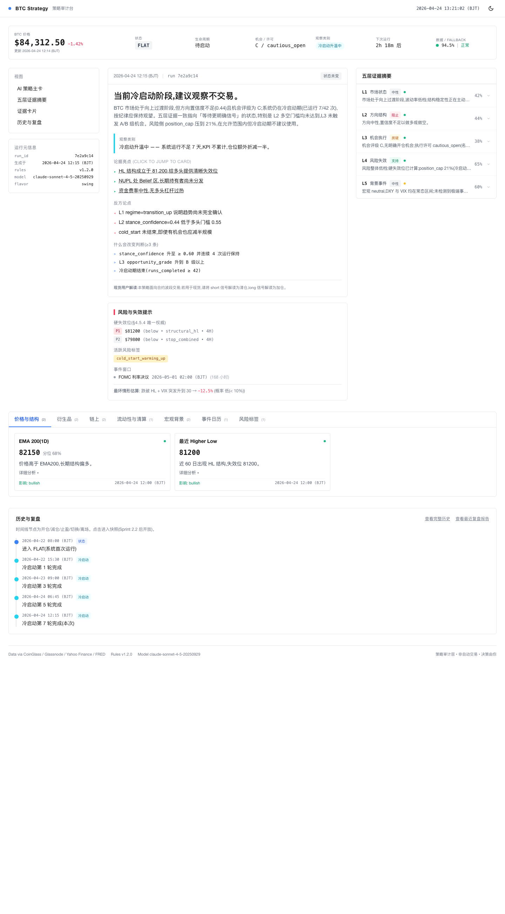
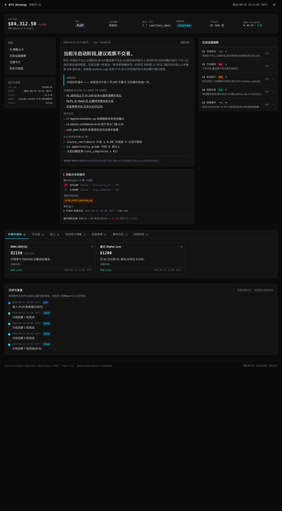
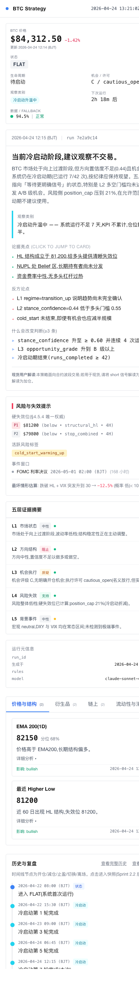

# Sprint 2.1 报告:BTC 策略系统 Web 前端第一版骨架

## Triggers(偏离建模 / 自主决策)

1. **Alpine.js 初始化顺序坑**:`<html x-data="app()">` 在 Alpine 初始化时立刻求值 `app`,如果 Alpine CDN 先于 `assets/app.js` 加载,`app` 还没定义,整个根组件拿不到数据 → 首次 headless 截图只有顶栏 logo。最终用把 `app.js` 放到 **Alpine CDN 之前**(且 `app.js` 不带 `defer`)的办法修掉,已写入注释防止后续回归。
2. **`?theme=dark` / `?theme=light` URL 查询参数**:原需求没要求,但为了 headless 截图和产品经理预览方便,加了查询参数作为 theme 的**最高优先级**,仍然保留 localStorage → `prefers-color-scheme` 的兜底。
3. **evidence_cards 类别 `key` 映射**:建模 §9.6 列出 7 个 tab 中文名;每个 tab 的内部 `category` key 用英文(`price_structure` / `derivatives` / `onchain` / `liquidity` / `macro` / `events` / `risk_tags`),为了贴合 evidence_card 模板里 v1.2 `category` 字段习惯,不改建模。
4. **手机端顶栏补了运行元信息卡片**:PC 端运行元信息(run_id / rules / model / flavor)放在左栏导航下方,手机端没有左栏,补了一块位于右栏底部的同内容卡片,避免手机端看不到实际 AI 模型版本等元信息。
5. **延时 `cold_start_tick` 作为 timeline 节点类型**:建模 §9.7 原文只列举"开仓/减仓/止盈/切换/离场",MOCK 数据里我也加了 `cold_start_tick` 类型(因为当前场景是冷启动第 7 轮,没有任何交易事件),timeline_node_type 颜色 / 标签表里多了这一档。Sprint 2.2 真实接入数据时可以取消或保留。
6. **Headless Chrome 截图需要 `--virtual-time-budget=8000`**:Tailwind 通过 CDN JIT 生成样式 + Alpine fetch `/mock/*` JSON 需要时间,Chrome headless 默认立即截图只会拍到空白。文档里写进 README。

## Task 执行结果

### Task A:目录结构

```
web/
├── index.html                   单文件应用入口(~30 KB)
├── assets/
│   ├── styles.css               Tailwind 之外的少量自定义(~1.8 KB)
│   └── app.js                   Alpine 组件 + BJT 时间 / 格式化工具(~13.6 KB)
├── mock/
│   └── strategy_current.json    建模 §7 StrategyState 完整 MOCK(~13.8 KB)
└── README.md                    前端说明
```

### Task B:index.html 骨架

- Tailwind CSS 通过 `https://cdn.tailwindcss.com` + inline `tailwind.config = { darkMode: 'class', ... }`
- Alpine.js 3.14.1 via jsDelivr CDN
- Google Fonts 引入 Inter + JetBrains Mono
- 页面标题 "BTC 策略审计台"
- 固定顶栏:logo(蓝色圆点 + "BTC Strategy")+ 实时 BJT 时钟 + dark/light 切换按钮(太阳 / 月亮 SVG)
- PC 布局(≥1024px):20% 左 + 50% 中 + 30% 右,底部通栏;手机(<1024px)单栏按 §9.2 五段顺序

### Task C:顶部全局状态条(§9.3)

一行 PC 8 列 grid:
- BTC 价格(大字)+ 24h 涨跌(彩色)+ 更新时间
- 当前策略状态(14 档配色表,MOCK 当前为 FLAT 灰底)
- 生命周期阶段("待启动")
- 机会 / 许可(C / cautious_open)
- 观察类别 badge("冷启动升温中",cyan 色)
- 下次运行倒计时(从 `meta.next_run_eta_bjt` 计算)
- 数据健康灯(绿)+ 94.5% 完整度 + Fallback "正常"(绿)

### Task D:AI 策略主卡(§9.4)

- 头部:`生成时间 / run_id(短 8 位) / delta tag("状态未变")`
- 主结论区:一句话大字 + 3 段叙事
- 观察类别说明区(带色边):`cold_start_warming_up` → "冷启动升温中 —— 系统运行不足 7 天,KPI 不累计,仓位额外折减一半"
- 论据亮点(▸):3 条,点击跳转到对应证据卡并高亮 2 秒
- 反方论点(◂):3 条
- 什么会改变判断(▹):3 条,font-mono 显示
- `trade_plan` null 时不渲染交易计划卡(`<template x-if>`)
- 现货用户解读说明(静态文字)
- 独立的风险与失效提示卡片:hard_invalidation_levels(priority badge)+ active_risk_tags + event_windows + worst_case_estimate

### Task E:证据摘要手风琴(§9.5)

5 行,默认全部折叠。每行显示:
- `L1..L5` prefix(font-mono)
- 中文层名(市场状态 / 方向结构 / ...)
- contribution badge(supportive / neutral / challenging / blocking)
- 数据新鲜度 dot(§9.9 配色)
- 置信度 %
- 展开箭头(旋转 180°)

展开内容:verdict / key_signals(+ 绿)/ contradicting_signals(− 红,空时隐藏)

### Task F:证据卡片 tab(§9.6)

7 个 tab:价格与结构 / 衍生品 / 链上 / 流动性与清算 / 宏观背景 / 事件日历 / 风险标签。tab 旁边括号内显示当前类别的卡数。

每卡:name + fresh dot + current_value(font-mono 大字)+ 分位 % + one_line_interpretation + `<details>` 收起 analysis + direction 色字 + captured_at_bjt。

点击主卡里 primary_driver 的链接会:
1. 切换 tab 到对应类别
2. `scrollIntoView` 到卡片
3. 加 `ring-2 ring-blue-400 dark:ring-cyan-400` 高亮 2 秒

### Task G:历史与复盘(§9.7)

- 标题 + 描述("时间线节点为开仓/减仓/止盈/切换/离场。Sprint 2.2 后开放跳转")
- "查看完整历史" / "查看最近复盘报告" 链接(cursor-not-allowed 灰色,预留)
- 左边框竖线 + 小圆点 timeline
- 每节点:时间(font-mono)+ 类型 badge(状态/开仓/减仓/离场/切换/冷启动,配色)+ 描述文字

### Task H:字段展示优先级(§9.8)

| 级别 | 实现方式 | 实例 |
|---|---|---|
| 始终显示 | 直接渲染 | 状态条 / 主结论 / 硬失效位 |
| 默认展开可折叠 | `<details>` 或 `x-show` 默认 true | AI 叙事 / 论据亮点 |
| 默认折叠可展开 | `x-show="layerOpen[id]"` 默认 false | 五层证据展开 / 证据卡 analysis |
| 仅必要 | `<template x-if>` 条件渲染 | PROTECTION 态横幅 / trade_plan / error 提示 |

### Task I:时间统一(§9.9)

- 顶栏 BJT 时钟每秒更新(`_startClock` setInterval 1s)
- `formatBJT(isoString)` 工具函数在 [app.js](web/assets/app.js):任意 UTC ISO → `YYYY-MM-DD HH:mm (BJT)`
- 数据新鲜度配色:绿(< 1h)/ 黄(1-6h)/ 红(> 6h)—— `freshnessColor` 函数
- 倒计时(`countdownLabel` computed):从 `meta.next_run_eta_bjt` 解析,显示 `3h 24m 后` / `即将运行`

### Task J:Dark / Light Mode

- 顶栏右上角按钮切换(太阳 ↔ 月亮 SVG)
- 优先级:URL `?theme=dark/light` → `localStorage["btc_strategy_theme"]` → `prefers-color-scheme` 兜底
- Tailwind `darkMode: 'class'`,`<html :class="{ 'dark': darkMode }">` 动态加类
- Light:白底 `#ffffff` + 深灰字 `#1a1a1a` + 蓝色强调 `blue-500/600/700`
- Dark:近黑底 `#0a0a0a` + card `#131313` + border `#2a2a2a` + 浅灰字 `#e5e5e5` + 青色强调 `cyan-300/400`
- 过渡:`transition-colors duration-150`,切换不突兀

### Task K:MOCK 数据

[web/mock/strategy_current.json](web/mock/strategy_current.json) 13.8 KB,12 业务块齐全:
- **场景**:FLAT + cold_start_warming_up,第 7 / 42 轮
- **market_snapshot**:$84,312.50,24h -1.42%
- **main_strategy**:action_state=FLAT,grade=C,permission=cautious_open
- **evidence_summary**:L1 transition_up / L2 neutral(conf 0.44)/ L3 C 档 / L4 overall_risk_level=low position_cap=21% / L5 macro neutral
- **evidence_cards**:11 张 across 7 categories
- **risks**:structural HL @ $81,200 priority=1 + stop_combined @ $79,800 priority=2 + FOMC 7 天后
- **ai_verdict**:完整含 primary_drivers / counter_arguments / what_would_change_mind ≥3

### Task L:在本地跑起来

- `uv run uvicorn src.api.app:app --host 0.0.0.0 --port 8000` 启动
- FastAPI StaticFiles 挂在 `/`,`html=True` 让 `/` → `/index.html`
- 不干扰 `/api/*` 路由(routes 必须先 include,static mount 最后)
- 无 npm / webpack / 任何构建步骤

**Live 验证(Chrome headless at http://127.0.0.1:8001)**:
- `GET /` → 200,HTML 30 KB
- `GET /assets/app.js` → 200,13.6 KB
- `GET /assets/styles.css` → 200,1.8 KB
- `GET /mock/strategy_current.json` → 200,13.8 KB
- `GET /api/system/health` → 200(路由仍正常)
- Chrome DevTools 日志无 uncaught / TypeError / ReferenceError
- 全仓库 pytest:**325 passed / 1 skipped**

## 截图

**Desktop — Light mode(1440×2600 全页截图)**



**Desktop — Dark mode**



**Mobile — Light mode(390 宽,单栏 5 段)**



## Commits(每批次都立即 push)

1. `2c38a81` — Sprint 2.1-1: web/ skeleton + mock data + FastAPI static mount
2. `2c1a78b` — Sprint 2.1-2: global status bar + AI main card + evidence summary accordion(含 Alpine init 顺序修复)
3. `5b6123a` — Sprint 2.1-3: evidence card tabs + history section(+ timeline type badge)
4. (本 commit)— Sprint 2.1-4: final screenshots + report

## 简短三段汇报

**结果**:BTC 策略前端骨架第一版完成并 push 到 GitHub。`web/` 目录下单 HTML + `app.js` + `styles.css` + `mock/strategy_current.json` + `README.md`,无 npm 构建,Alpine.js + Tailwind CSS 全走 CDN。FastAPI `StaticFiles` 挂到根路径 / 且不干扰 `/api/*`。页面严格按建模 §9.2 三栏布局(PC 20/50/30)/ 单栏 5 段(手机),§9.3 顶栏状态条 / §9.4 AI 主卡 + 交易计划占位 / §9.5 五层手风琴 / §9.6 证据卡 tab / §9.7 时间线 / §9.8 展示优先级 / §9.9 BJT 时钟 / §9.10 ?theme= 切换。Chrome headless 三个视角截图(desktop light / dark / mobile)渲染正常,DevTools 无 JS 报错。全仓库 325 pass / 1 skipped 保持绿。

**自主决策**(详见 Triggers 段):
1. 发现并修复 Alpine.js 初始化顺序坑(`app.js` 必须在 Alpine CDN **之前** 且不带 defer,否则 `<html x-data="app()">` 拿不到根组件)
2. 加 `?theme=dark/light` URL 参数作为 theme 优先级最高的来源(方便截图 / 预览)
3. 手机端补运行元信息卡片(PC 左栏的信息,手机端无左栏)
4. Timeline 节点类型加 `cold_start_tick` 档(当前场景没有真实交易事件)
5. 截图需要 `--virtual-time-budget=8000`,已写入 README 提醒

**待关注**(给 Sprint 2.2):
1. 现在数据走 `fetch('/mock/strategy_current.json')`,Sprint 2.2 需要改为 `/api/strategy/current` + `/api/strategy/stream` SSE
2. 论据亮点 `primary_driver.evidence_ref` 的 `card_id` 是跳转 key,需要后端 `/api/strategy/current` 返回的 `ai_verdict.primary_drivers[].evidence_ref` 和 `evidence_cards[].card_id` 严格对齐
3. 证据卡 tab 的 `category` 字段 key 必须是 `price_structure / derivatives / onchain / liquidity / macro / events / risk_tags`,若后端返回其他 key 需要对齐
4. 字号 / 间距参考了 bitmiro.com 的克制调性,用户拿到手后如觉信息密度不够可以调 Tailwind config 里的 `spacing` / `fontSize`
5. 历史与复盘的两个 "查看" 链接当前灰态,Sprint 2.2+ 应链到 `/api/strategy/history` 和 `/api/review/{lifecycle_id}`
6. 部署到 124.222.89.86 的 nginx 配置还没写(本 Sprint 只做本地骨架)
