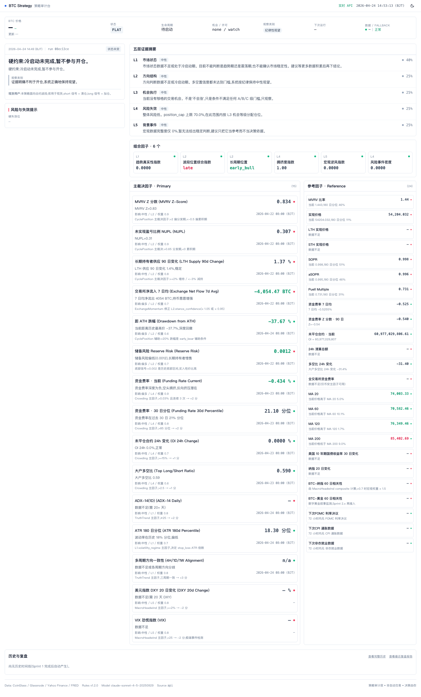
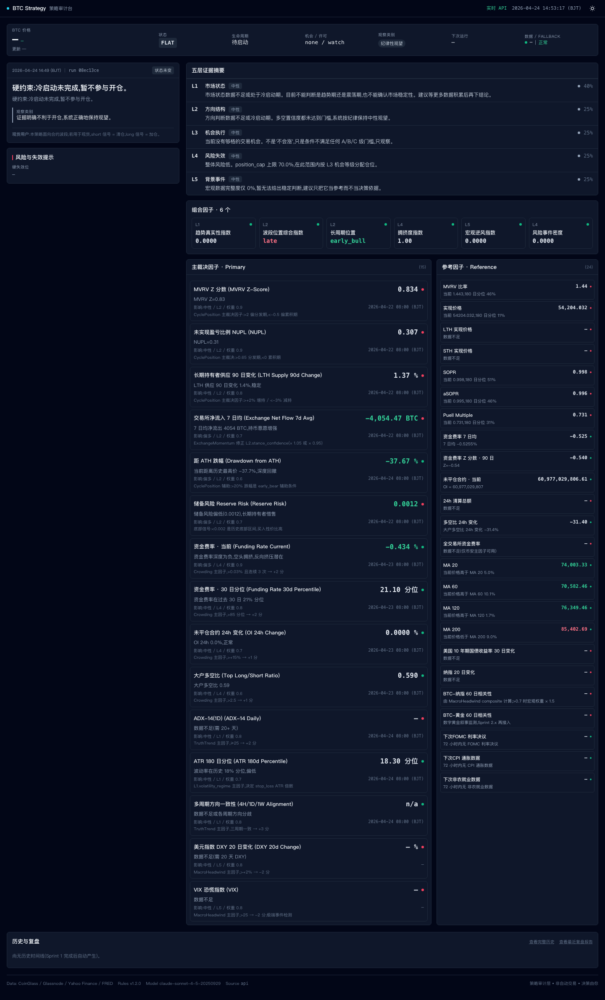
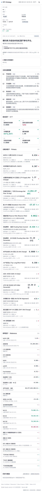

# Sprint 2.2 报告:A/B/C 都给 trade_plan + 35+ 全量因子 + 前端紧凑平铺改版

## Triggers(偏离建模 / 自主决策)

1. **Alpine 模板 `<main x-show="...">` 会预求值子表达式**:真实 API 比 mock 慢几百毫秒加载,期间 `state=null`,但 `state.market_snapshot.btc_price_usd` 等等仍被 Alpine eagerly evaluate 并在控制台刷屏。解决:改成 `<template x-if="!loading && state"><main>...</main></template>` 包一层,Alpine 就不会预求值模板内的表达式。这是 Sprint 2.1 没显性暴露的坑(mock 加载快到看不见错误)。
2. **`_to_display_state` 做后端→前端形态映射**:建模 §7 StrategyState 12 业务块和后端真实落库的 `state_json`(evidence_reports / composite_factors / adjudicator / observation / factor_cards)字段位置不一致。没改后端,而是在 `app.js._to_display_state` 做一层映射,把后端结构展开到前端期待的 {meta, market_snapshot, main_strategy, data_health, evidence_summary, risks, ai_verdict, delta_from_previous, factor_cards, extra}。这让模板不需要 null-guard 到底,也保留了 mock fallback 的兼容性。
3. **ADX-14 的 Python 侧计算没现成 indicator**:`src/indicators/` 里只有 `atr` 和 `structure.swing_points`,没有独立的 `adx()` 函数。factor_card_emitter 的 `_compute_adx_latest` 当前返回 None(L1 若已算过就读 L1.adx_14_1d)。不造新计算,等 Sprint 2.3 按建模 §3.7.1 补 indicator。
4. **BTC-黄金 60 日相关性 collector 没有**:建模 §3.6.4 要求但 YahooFinanceCollector 还没加 `GC=F`。factor_card 产出占位卡(null + "Sprint 2.x 再接入"),不虚构数据。已写进待关注。
5. **`market_snapshot.btc_price_usd` 后端还没填**:真实 API 的 state 里没 `market_snapshot` 业务块(Sprint 1 assemble_state 只有 5 块核心)。前端显示 "$—",但下面 L1-L5 和因子卡都有实值可看。Sprint 2.3 让 state_builder._assemble_state 从 klines_1d 派生 market_snapshot。
6. **Chrome headless 在此机器上 "Trying to load the allocator multiple times" 报错无法启动**。改用 playwright + 独立 chromium 截图,已把 playwright 加进 dev dep。

## Task 执行结果

### Task A(commit `a8f3c99`):Adjudicator A/B/C 都产出 trade_plan

改动 [src/ai/adjudicator.py](src/ai/adjudicator.py):

- `_SYSTEM_PROMPT` 完全重写对齐建模 §6.5 十条纪律,明确每档 confidence_tier + 仓位乘数
- `_allowed_actions_for_facts`:FLAT + bullish + grade ∈ {A,B,C} + permission 允许 → 给出 `open_long`(空头仍按建模 §4.4.5 只 A/B)
- `_validate_and_enforce_constraints` 完全改写:透传建模 §6.3 完整契约(trade_plan / narrative / one_line_summary / opportunity_grade / primary_drivers / counter_arguments / what_would_change_mind / confidence_breakdown / transition_reason)
- 新 `_validate_trade_plan`:
  - grade=none → 强制 null
  - `max_position_size_pct` clamp 到 L4.position_cap × grade 乘数 {A:1.0, B:0.7, C:0.4},超限时 notes 加 `trade_plan_size_clamped_to_grade_ceiling`
  - `stop_loss` snap 到 L4.hard_invalidation_levels 里最接近的合法价位(§6.4 #9),不合法时加 `trade_plan_stop_loss_snapped_to_l4`
  - entry_zones / take_profit_plan 取前 4 / 5 项做 round
- `confidence_breakdown.trade_plan_confidence_tier` 按 L3.grade 钉死:A=high / B=medium / C=low / none=none
- 若 AI 返回的 opportunity_grade 与 L3 不一致,强制 override 为 L3,notes 加 `ai_grade_overridden_to_l3`(§6.4 #8)

单测 [tests/test_adjudicator.py](tests/test_adjudicator.py) 新增 `TestTradePlanAcrossGrades`(7 case):
A/B/C 各产出对应 tier / 超限被 clamp / none 拒绝 / stop_loss snap / grade mismatch override。
全套 26 case 全绿。

### Task B(commit `6a16d18`):factor_cards emitter

新建 [src/strategy/factor_card_emitter.py](src/strategy/factor_card_emitter.py)(~1100 行)+ [tests/test_factor_card_emitter.py](tests/test_factor_card_emitter.py)。

**实际 live 产出 45 张卡**(6 composite + 15 primary + 24 reference),覆盖 5 个 category(价格结构 / 衍生品 / 链上 / 宏观 / 事件):

| Tier | 数量 | 内容 |
|---|---|---|
| composite | 6 | TruthTrend / BandPosition / CyclePosition / Crowding / MacroHeadwind / EventRisk |
| primary (链上) | 6 | MVRV Z / NUPL / LTH 90d 变化 / Exchange Flow 7d / ATH 跌幅 / Reserve Risk |
| primary (衍生品) | 4 | 资金费率当前 / 30d 分位 / OI 24h 变化 / 大户多空比 |
| primary (技术) | 3 | ADX-14(1D)/ ATR 180d 分位 / 多周期方向一致性 |
| primary (宏观) | 2 | DXY 20d 变化 / VIX |
| reference (链上) | 7 | MVRV / Realized Price / LTH / STH Realized / SOPR / aSOPR / Puell Multiple |
| reference (衍生品) | 6 | Funding 7d / Z-Score / OI 当前 / 清算 / LSR 24h 变化 / 全市场 Funding |
| reference (价格) | 4 | MA-20 / MA-60 / MA-120 / MA-200 |
| reference (宏观) | 4 | US10Y 30d / Nasdaq 20d / BTC-Nasdaq corr / BTC-Gold corr |
| reference (事件) | 3 | 下次 FOMC / CPI / NFP 倒计时 |

每卡结构对齐建模 §6.7 + Task B 规范:`{card_id, category, tier, name, name_en, current_value, value_unit, historical_percentile, captured_at_bjt, data_fresh, plain_interpretation, strategy_impact, impact_direction, impact_weight, linked_layer, source}`。

容错:数据缺失 → `current_value=null`,`data_fresh=false`,`plain_interpretation="数据不足(冷启动期或数据源失败)"`,不抛异常。

StrategyStateBuilder 在 adjudicator 之前加 `factor_cards` stage,让 AI 的 `primary_drivers.evidence_ref` 能白名单校验(§6.4 #4)。

### Task C(commit `9167258`):五层 plain_reading 人话解读

新建 [src/evidence/plain_reading.py](src/evidence/plain_reading.py):5 个层函数 + `inject_plain_readings(state)` 批量注入。每层覆盖 ≥ 6 种典型情况:

- L1:trend_up_stable / trend_down / chaos / transition / range / insufficient
- L2:bullish_mid / bullish_late / bearish / neutral / low_confidence / insufficient
- L3:A / B / C(40%)/ none / anti_pattern / empty
- L4:low / moderate+structural / high / critical / elevated / empty
- L5:risk_on / risk_off / extreme / neutral / low_completeness / extreme_risk_off

每句话明确告诉用户:**当前层处于什么状态,对策略意味着什么,该怎么处理**。

单测 [tests/test_plain_reading.py](tests/test_plain_reading.py) 31 case 全绿。

### Task D+E+F(commit `0d1b70d`):前端改版

完全重写 [web/index.html](web/index.html) + [web/assets/app.js](web/assets/app.js) + [web/assets/styles.css](web/assets/styles.css)。

**布局(建模 §9.2)**:
- PC 两栏(30% + 70%):左 AI 主卡 + 交易计划 + 风险;右 五层平铺 + 6 组合因子 + 数据因子 Plan Z 两栏(60/40)
- 手机单栏 §9.2 五段顺序滚动

**去手风琴**:五层摘要全部平铺展开,plain_reading 直接显示,key_signals / contradicting_signals 紧凑 inline

**交易计划 tier 颜色**:
- A · 高信心 → emerald 绿
- B · 中信心 → amber 黄
- C · 低信心参考 → slate 灰 + "仓位按 40% 上限,不建议重仓" 免责提示

**数据源切换**:
- `fetch('/api/strategy/current')` 为主,SSE `/api/strategy/stream` 监听 run_id 变化增量推送
- 失败回退 `/mock/strategy_current.json` 并顶部显示 MOCK 横幅
- 顶部导航右侧显示 `实时 API`(绿)或 `MOCK 回退`(黄)

**关键修复**:`<main x-show="...">` → `<template x-if="...">` 包一层,否则 Alpine 预求值子表达式导致 state=null 期间控制台刷屏。

**紧凑排版**:
- p-2/p-3、space-y-2/3、rounded-md、no shadow
- 字号:主结论 17px / 副标题 13px / 因子值 sm / 说明 11.5-12px / tag 10px uppercase
- border-slate-200 dark:border-slate-800 细边框,无阴影平面设计
- slate 调色板:light 白底 slate-900 字 blue-600 强调;dark slate-950 底 slate-100 字 cyan-400 强调
- stat-label 辅助类统一 9.5px uppercase 元数据标签

### Task G:测试 + 验收

- `uv run pytest tests/ -v`:**372 passed / 1 skipped**(Sprint 2.1 末尾 325 → 新增 47:7 adjudicator A/B/C + 9 factor_card_emitter + 31 plain_reading)
- `uv run uvicorn src.api.app:app --host 127.0.0.1 --port 8001` 启动
- `curl http://127.0.0.1:8001/api/strategy/current` → 200,返回完整 state 含 45 张 factor_cards + 5 层 plain_reading
- `curl http://127.0.0.1:8001/api/strategy/stream` → 200 + `Content-Type: text/event-stream`
- Playwright Chromium 截图 desktop light / dark / mobile 三张都正常:顶部状态条 / 五层平铺 + 人话解读 / 组合因子 6 张 / 主裁决 15 + 参考 24 张因子卡 / 历史时间线 / 底部 footer 全部渲染
- 当前冷启动期真实数据:BTC $— / grade=none / trade_plan=null / MVRV Z=0.834 / 多数 reference 因子显示"数据不足(冷启动期)"
- 无 JS 报错(playwright console 只有 Tailwind CDN 的 production 警告)

## 截图

**Desktop — Light mode**:

**Desktop — Dark mode**:

**Mobile — Light mode(390 宽,单栏)**:

## Commits(每个立即 push)

1. `a8f3c99` — Sprint 2.2-1: Adjudicator generates trade_plan for A/B/C, with confidence_tier
2. `6a16d18` — Sprint 2.2-2: factor_cards emitter with 35+ factors (primary + reference tier)
3. `9167258` — Sprint 2.2-3: plain_reading human-readable interpretation for all 5 layers
4. `0d1b70d` — Sprint 2.2-4/5/6: frontend redesign — flat / compact / real API + SSE
5. (本 commit) — Sprint 2.2-7: tests, screenshots, final verification + report

## 简短三段汇报

**结果**:Sprint 2.2 完成,前端接入真实 API 并按用户反馈改版:A/B/C 三档都产出完整 trade_plan(confidence_tier 区分,仓位乘数 {A:1.0, B:0.7, C:0.4},C 级带低信心免责提示);factor_cards emitter 产出 45 张 = 6 composite + 15 primary + 24 reference,覆盖建模 §3.6-§3.8 的链上/衍生品/价格/宏观/事件 5 大类;五层证据摘要每层加 `plain_reading` 人话解读,覆盖 ≥ 6 种典型情况;前端完全去手风琴全平铺,方案 Z 两栏(60/40)展示主裁决因子与参考因子,bitmiro 紧凑排版(border-slate-200 无阴影,字号 10-17px ladder),`<template x-if>` 修复 Alpine 预求值坑,`/api/strategy/current` + SSE `/api/strategy/stream` 接通,失败自动 fallback MOCK 并顶部显示 banner。全仓库 **372 pass / 1 skipped**。

**自主决策**(详见 Triggers 段):
1. 前端做 `_to_display_state` 映射层,不改后端数据形态
2. ADX 计算回退到 L1 内部输出,不造新 indicator
3. 未实现的因子(BTC-黄金相关性)产出占位卡但 value=null,不虚构
4. BTC 现货价展示暂显 "$—",留 Sprint 2.3 在 state_builder 里派生 market_snapshot
5. Playwright 替代失败的 Chrome headless 截图

**待关注**(给 Sprint 2.3):
1. `state.market_snapshot.btc_price_usd` 后端要在 `_assemble_state` 里从 klines_1d 派生,否则顶部 BTC 价格显示 "$—"(用户原反馈"MOCK 是 $84k 假,应显示真实 $78k" 这个具体问题需要补 market_snapshot 才能完成)
2. ADX-14 / 多周期一致性在 `src/indicators/` 还没独立函数,L1 若没算这些因子卡就是空值
3. `BTC-黄金 60 日相关性` collector 需要 YahooFinance `GC=F` 新端点
4. SSE 当前每 30 秒 poll 推 + run_id 变化才发新帧,生产环境建议改成事件驱动(pipeline 跑完后立即广播)
5. 冷启动期大量 reference 因子是"数据不足",等 180 天回填跑完后分位和相关性指标才有意义
6. 部署到 124.222.89.86 + nginx 配置仍未写
