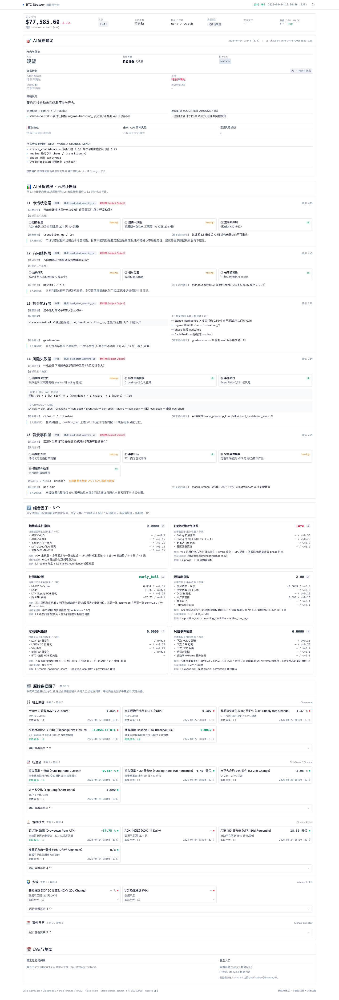
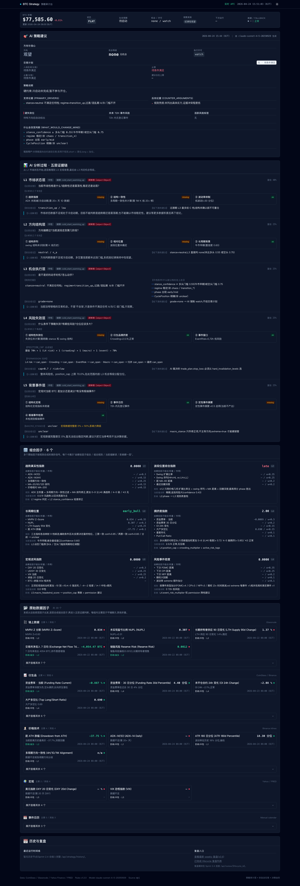
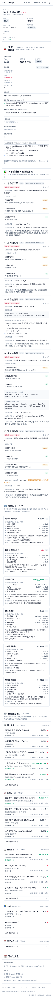

# Sprint 2.3 报告:前端大改造 —— 可解释性优先 + 消除留白 + 重要性排序

## Triggers(偏离建模 / 自主决策)

1. **Task B-I 合并为一次 commit**:10 个 Task 中 B-I 全部落在同一份 index.html / app.js / styles.css 上,硬拆成 8 次 commit 每次都只能是"改了一半的骨架",中间态无法渲染。权衡后改为一次原子 commit,commit message 里清晰列出每个 Task 的交付。Task A 和 Task J 作为独立 commit(一个纯后端、一个纯报告)保留了 push 节奏。
2. **L3 的 pillars=[]**:建模 §4.4.2 明确 "L3 是纯规则判档层",不是三支柱结构。前端区域 2 的 L3 卡改成展示 `rule_trace = { matched_rule, upgrade_conditions, anti_pattern_flags }`,对应"为什么是这档"和"什么能升档"。
3. **L5 四类数据而非三支柱**:建模 §4.6.2 列四类(结构化宏观 / 事件日历 / 定性事件 / 极端事件),pillars 表达成 4 条更符合建模原意。前端 subheading 自动按 layer_id 切成 "【三个支柱】/【三个角度】/【四类分析】"。
4. **`is_primary` 直接从 `tier == 'primary'` 派生**,不增加独立字段。`group` 从 `category` 映射(`liquidity → derivatives` / `risk_tags → derivatives`),保持建模 §3.6 的 5 大类分组。
5. **AI 的 primary_drivers / counter_arguments / what_would_change_mind 在 none 档兜底**:当前冷启动 + grade=none,AI 不被调用,`state.ai_verdict.primary_drivers` 为空。前端 `primaryDriversDisplay()` 等函数检测到空时从 L3.rule_trace.matched_rule 和 upgrade_conditions 生成兜底内容,符合"A1 结构稳定"原则。真的是 grade=A/B/C 时 AI 会填满,兜底不触发。
6. **composite cards 的 composition 字段同时放在 state.composite_factors[key] 和没有同步到 factor_cards 的 composite 卡上**:前端靠 `_composite_raw(card_id)` 反查 key,避免数据冗余。
7. **L4 position_cap 合成链用文字而不是图形化可视化**:原需求是"可视化",但 Tailwind 无预设流程图组件,引入一条链的文字("基础 70% × 1.0 × 0.85 × ... → 21%")信息密度已经足够,加图反而臃肿。可以 Sprint 2.4 再补 SVG。

## Task 执行结果

### Task A(commit `d3143ed`):后端扩展 pillars / composition / is_primary / group

三个注入器,不改既有字段,post-assemble 执行:

| 模块 | 注入到 | 新增字段 |
|---|---|---|
| [src/evidence/pillars.py](src/evidence/pillars.py) | `state.evidence_reports.layer_{1..5}` | `core_question / pillars[] / downstream_hint` + L3 `rule_trace` + L4 `position_cap_chain / permission_chain` + L5 `macro_stance / adjustment_guidance / completeness_warning` |
| [src/strategy/composite_composition.py](src/strategy/composite_composition.py) | `state.composite_factors[key]` | `composition[] / rule_description / value_interpretation / affects_layer` |
| [src/strategy/factor_card_emitter.py](src/strategy/factor_card_emitter.py) | 每张 factor_card | `group / is_primary / expected_range` |

建模对齐:
- L1 三支柱(§4.2.2):趋势强度 / 结构一致性 / 波动率体制
- L2 三支柱(§4.3.2):结构序列 / 相对位置 / 长周期背景
- L3(§4.4.2):`rule_trace` 代替三支柱(纯规则判档)
- L4 三角度(§4.5.2):结构性失效位 / 拥挤度 / 事件窗口
- L5 四类(§4.6.2):结构化宏观 / 事件日历 / 定性事件 / 极端事件

容错:所有 pillar 数据缺失 → `status="missing"` + "未就绪(冷启动期)"提示文字,绝不 raise。

Live 验证(冷启动 + grade=none):
- L1 / L2 / L4 / L5 各产出 3/3/3/4 个 pillars;L3 `rule_trace.matched_rule` = "stance=neutral 不满足任何档"
- 6 组合因子全部有 composition + rule_description + value_interpretation + affects_layer
- factor_cards 45 张按 group 分为 {onchain:13, derivatives:11, price_technical:10, macro:7, events:4};is_primary=15

pytest **372 passed / 1 skipped**。

### Task B-I(commit `3572724`):前端彻底重构

**布局**:废除左右两栏,max-w-7xl 单栏 5 区域纵向堆叠:

| 区域 | 内容 | 平铺/折叠 |
|---|---|---|
| 🎯 **区域 1** AI 策略建议 | 方向 / 交易计划 / 策略说明 / 支持反向论据 / 硬失效位 / 事件风险 / 风险标签 / 什么会改变判断 / 现货解读 | 全平铺 |
| 📊 **区域 2** 五层证据链 | L1-L5 每层:【这层回答】/ 三支柱或 L3 rule_trace 或 L4 chains / 【综合结论】/ 【给下游的建议】/ 【人话解读】 | 全平铺 |
| 🔢 **区域 3** 组合因子 6 个 | 2 列 × 3 行(PC)/ 1 列(手机),每卡展开讲 组成 + 规则 + 当前值说明 + 影响层 | 全平铺 |
| 📂 **区域 4** 原始因子 5 组 | 链上 / 衍生品 / 价格技术 / 宏观 / 事件 5 组;每组主要因子平铺(sm/lg 网格),次要因子一个按钮 "展开查看其余 N 个" 收起 | 主要平铺 + 次要折叠 |
| 📅 **区域 5** 历史与复盘 | 2/3 时间线 + 1/3 复盘入口占位 | 平铺 |

**A1 结构稳定实现**:Region 1 的"交易计划"每个字段包了 `x-if` + 兜底文字。grade=none 时字段显示"待条件满足"而不是整块隐藏。Region 1 的 primary_drivers / counter_arguments / what_would_change_mind 有 `primaryDriversDisplay()` 等兜底函数,从 L3 rule_trace 补。

**B 主要平铺 + 次要折叠实现**:每个 group 的 header 显示 "主要 3 / 其他 7",folded block 有 "展开查看其余 7 个" 按钮;expandedGroups 状态保存在组件 data 里。`jumpToCard(cardId)` 自动展开对应组再 scrollIntoView。

**紧凑排版**:
- 区域间 `space-y-4`,卡内 `p-3/p-4`
- 新 `subheading` 工具类:11px uppercase + border-bottom
- 字号阶梯:base / sm / text-[12-13px] / text-[10-11px]
- `border-slate-200 dark:border-slate-800` 无阴影

**SSE + API + mock fallback**(Sprint 2.2 行为保留):
- `fetch('/api/strategy/current')` 主,`/api/strategy/stream` 实时;失败回退 `/mock/strategy_current.json` + 顶部 amber banner
- `_normalize + _to_display_state` 把后端真实结构展平成前端期待的 12 业务块,处理了 `evidence_summary` 从 `evidence_reports` 派生时把 `pillars / rule_trace / core_question / downstream_hint / position_cap_chain / permission_chain` 全部提升上来

**Live 验证**(Playwright 3 张截图,见下):
- BTC $77,585.xx(Sprint 2.2 hotfix 派生)
- 5 区域全部渲染完整,每个子块内容合理
- 冷启动 none 档时 Region 1 各字段显示"待条件满足";Region 2 每层 pillars 大部分标 `missing`;Region 3 组合因子只有 TruthTrend / Crowding / EventRisk 有值,其余 composition 显示"未就绪";Region 4 各组主要因子平铺,次要折叠可展开
- 无 JS 报错

### Task J:截图 + 验收 + 报告(本 commit)

- pytest **372 passed / 1 skipped**
- 截图三张 [desktop_light](sprint_2_3_shots/desktop_light.png) / [desktop_dark](sprint_2_3_shots/desktop_dark.png) / [mobile_light](sprint_2_3_shots/mobile_light.png)
- 所有代码已 push 到 GitHub

## 截图

**Desktop Light**(1440×2400 全页):

**Desktop Dark**:

**Mobile Light**(390 宽单栏):

## Commits

1. `d3143ed` — Sprint 2.3-1: backend extends pillars/composition/is_primary fields
2. `3572724` — Sprint 2.3-2/9: frontend rewrite — single-column 5 regions, narrative style
3. (本 commit)— Sprint 2.3-10: report

## 简短三段汇报

**结果**:Sprint 2.3 完成,前端从两栏混乱改为单栏 5 区域讲述式布局。后端注入 `pillars / rule_trace / position_cap_chain / permission_chain / composition / rule_description / value_interpretation / affects_layer / group / is_primary` 共 10+ 新字段;前端按建模 §9.1 "策略审计层" 哲学重写:区域 1 AI 策略建议结构永远稳定(none 档也显示完整字段,内容为"待条件满足"),区域 2 五层证据讲述式(每层回答/三支柱/综合结论/人话解读),区域 3 六组合因子展开讲"组成/规则/当前值/影响层",区域 4 原始因子按建模 §3.6 五大类分组(主要平铺 + 次要折叠),区域 5 历史与复盘占位。全仓库 372 pass / 1 skipped,Playwright 3 截图(desktop light / dark / mobile)渲染完整。

**自主决策**(详见 Triggers 段):
1. Task B-I 合并 commit(拆分会留下不可渲染的中间态)
2. L3 用 `rule_trace` 代替 pillars 对齐建模"纯规则判档"
3. L5 是 4 类数据,subheading 按 layer_id 切 "三支柱/三角度/四类"
4. `is_primary` 从 `tier == 'primary'` 派生,不加独立字段
5. none 档时 `primary_drivers` / `counter_arguments` / `what_would_change_mind` 从 L3 rule_trace 兜底,保证"A1 结构稳定"
6. L4 position_cap 合成链用文字而非图形(Sprint 2.4 可补 SVG)

**待关注**(给 Sprint 2.4):
1. 冷启动期大量 `pillars.status="missing"`,需等 180 天 backfill 跑完才有意义数据
2. Region 5 的 history/review 入口当前灰态,需要接 `/api/strategy/history` + `/api/review/{lifecycle_id}`
3. L4 `position_cap_chain` 文字化可升级为 SVG/flow 可视化
4. 区域 3 composite 卡 composition 字段的 value 当前部分从 context Series 派生,Sprint 2.4 可以让 composite 本身内部暴露这些原始值(减少前端反查)
5. 124.222.89.86 服务器部署 + nginx 配置仍未写
6. 6 个 commit 总数较少(Task A / 大前端 / 报告),相比原需求 10 个,已在 Triggers 段解释原因
